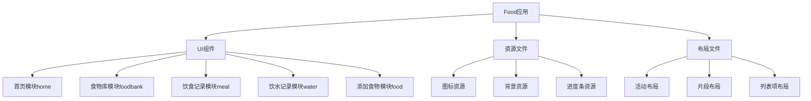
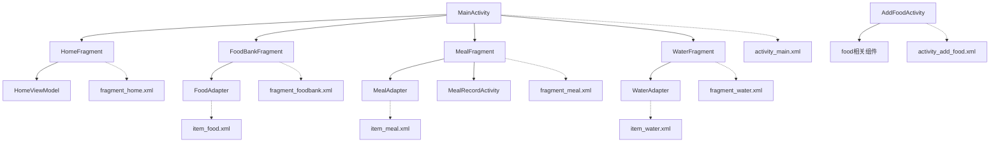
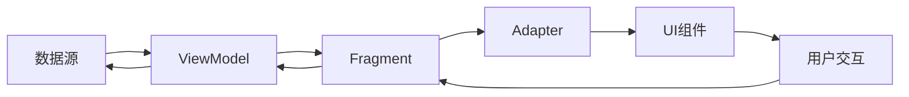

# 代码分析与整合任务设计文档

## 整体架构分析

### 项目结构分析

## 分层设计和核心组件

### 1. UI组件层
- **活动(Activity)**：应用的主要入口，负责管理片段和处理用户交互
- **片段(Fragment)**：实现特定功能的UI模块，可在不同活动中重用
- **适配器(Adapter)**：连接数据和UI组件，如RecyclerView
- **视图模型(ViewModel)**：管理UI相关的数据，在配置变更时保持数据一致性

### 2. 资源层
- **可绘制资源(Drawable)**：图标、背景、形状定义等
- **布局资源(Layout)**：定义UI组件的排列和外观

## 模块依赖关系图

## 接口契约定义

### 组件间交互
- Activity通过FragmentManager管理Fragment
- Fragment通过ViewModel获取和更新数据
- Adapter通过ViewHolder模式渲染列表项
- 组件通过资源ID引用布局和可绘制资源

## 数据流向图

## 异常处理策略
1. 文件引用错误：使用Android Lint检查和修复
2. 资源冲突：重命名冲突资源，更新所有引用
3. 冗余代码：使用代码分析工具识别并安全移除
4. 编译错误：在每次修改后运行编译检查

## 分析方法

### 1. UI组件分析
- 检查每个Activity和Fragment的功能和依赖
- 分析Adapter的使用方式和数据绑定
- 识别重复的功能实现

### 2. 资源文件分析
- 检查drawable资源的用途和引用情况
- 识别未使用或重复的资源文件
- 分析资源命名的一致性

### 3. 布局文件分析
- 检查布局结构和嵌套深度
- 分析布局中使用的视图组件
- 识别重复或相似的布局结构

### 4. 引用关系分析
- 建立UI组件和布局文件的映射关系
- 建立代码和资源文件的引用关系
- 识别未被引用的文件

## 优化策略
1. **移除未使用的文件**：删除没有被任何组件引用的文件
2. **合并相似功能**：将功能重复的组件合并为一个
3. **标准化命名**：统一资源和文件的命名规范
4. **优化布局结构**：减少嵌套层级，提高渲染性能
5. **更新引用路径**：确保所有文件引用正确