# 代码分析与整合任务拆分文档

## 任务依赖图

```mermaid
gantt
    title 代码分析与整合任务时间线
    dateFormat  HH:mm
    section 准备阶段
    创建分析文档目录           :a1, 00:00, 00:10
    section 分析阶段
    UI组件文件夹分析          :a2, after a1, 01:00
    图片资源文件夹分析        :a3, after a2, 01:00
    布局文件文件夹分析        :a4, after a3, 01:00
    引用关系分析              :a5, after a4, 01:30
    section 整合阶段
    识别并移除冗余文件        :a6, after a5, 02:00
    优化资源引用关系          :a7, after a6, 01:30
    section 验证与报告阶段
    编译验证                  :a8, after a7, 00:30
    生成分析报告              :a9, after a8, 01:00
```

## 子任务详情

### 任务1: UI组件文件夹分析
- **输入契约**:
  - UI组件文件夹路径: `/d:/Soft/AndroidProjects/Food/app/src/main/java/com/example/food/ui/`
  - 现有项目结构
- **输出契约**:
  - UI组件功能清单
  - 组件间依赖关系图
  - 可能的冗余组件列表
- **实现约束**:
  - 分析Java文件的类结构和功能
  - 识别继承关系和接口实现
  - 记录组件的关键功能和职责
- **依赖关系**:
  - 前置任务: 创建分析文档目录
  - 后置任务: 引用关系分析

### 任务2: 图片资源文件夹分析
- **输入契约**:
  - 图片资源文件夹路径: `/d:/Soft/AndroidProjects/Food/app/src/main/res/drawable/`
  - 现有项目结构
- **输出契约**:
  - 资源文件清单及其用途
  - 未使用资源识别
  - 可能的重复资源列表
- **实现约束**:
  - 分析XML和PNG资源文件
  - 记录资源的用途和特性
  - 识别相似或重复的资源
- **依赖关系**:
  - 前置任务: UI组件文件夹分析
  - 后置任务: 引用关系分析

### 任务3: 布局文件文件夹分析
- **输入契约**:
  - 布局文件文件夹路径: `/d:/Soft/AndroidProjects/Food/app/src/main/res/layout/`
  - 现有项目结构
- **输出契约**:
  - 布局文件功能清单
  - 布局结构分析
  - 可能的冗余布局列表
- **实现约束**:
  - 分析XML布局文件的结构
  - 记录布局中的组件和属性
  - 识别相似或重复的布局结构
- **依赖关系**:
  - 前置任务: 图片资源文件夹分析
  - 后置任务: 引用关系分析

### 任务4: 引用关系分析
- **输入契约**:
  - 前三个任务的分析结果
  - 完整项目代码
- **输出契约**:
  - 组件-布局引用映射表
  - 组件-资源引用映射表
  - 未引用文件清单
- **实现约束**:
  - 分析代码中的资源ID引用
  - 分析布局文件中的组件引用
  - 建立完整的引用关系网络
- **依赖关系**:
  - 前置任务: UI组件文件夹分析, 图片资源文件夹分析, 布局文件文件夹分析
  - 后置任务: 识别并移除冗余文件

### 任务5: 识别并移除冗余文件
- **输入契约**:
  - 引用关系分析结果
  - 冗余文件清单
- **输出契约**:
  - 移除冗余文件的操作记录
  - 更新后的项目结构
- **实现约束**:
  - 安全移除未使用的文件
  - 合并功能重复的文件
  - 保持代码功能完整性
- **依赖关系**:
  - 前置任务: 引用关系分析
  - 后置任务: 优化资源引用关系

### 任务6: 优化资源引用关系
- **输入契约**:
  - 更新后的项目结构
  - 引用关系分析结果
- **输出契约**:
  - 更新后的引用路径
  - 标准化的资源命名
- **实现约束**:
  - 更新所有修改文件的引用路径
  - 统一资源命名规范
  - 确保引用关系正确无误
- **依赖关系**:
  - 前置任务: 识别并移除冗余文件
  - 后置任务: 编译验证

### 任务7: 编译验证
- **输入契约**:
  - 优化后的项目代码
- **输出契约**:
  - 编译结果报告
  - 潜在问题修复记录
- **实现约束**:
  - 在Android Studio中编译项目
  - 解决编译错误和警告
  - 确保功能完整性
- **依赖关系**:
  - 前置任务: 优化资源引用关系
  - 后置任务: 生成分析报告

### 任务8: 生成分析报告
- **输入契约**:
  - 所有任务的分析结果
  - 编译验证结果
- **输出契约**:
  - 完整的分析报告
  - 整合前后的文件对比清单
  - 冗余代码分析报告
- **实现约束**:
  - 详细记录所有发现和修改
  - 提供清晰的文件对比
  - 总结优化成果
- **依赖关系**:
  - 前置任务: 编译验证
  - 最终任务