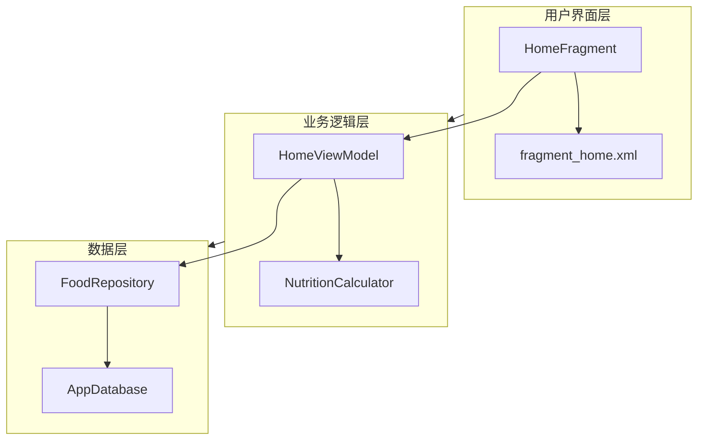
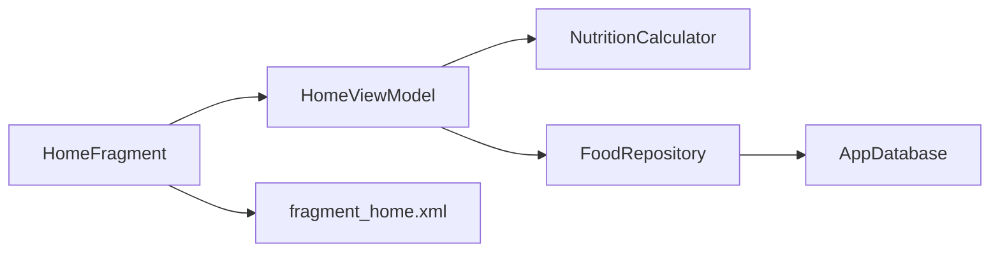
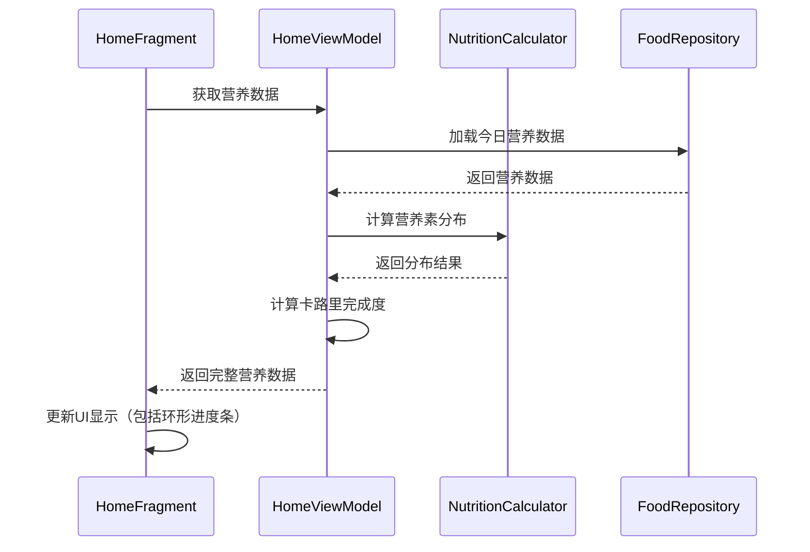

# 任务设计文档 - UI更新

## 整体架构图

## 分层设计和核心组件

### 1. 用户界面层（UI Layer）
- **HomeFragment**：首页Fragment，负责显示营养摄入统计和目标完成情况
- **fragment_home.xml**：布局文件，定义UI元素和样式

### 2. 业务逻辑层（Business Logic Layer）
- **HomeViewModel**：ViewModel类，处理数据加载和业务逻辑
- **NutritionCalculator**：营养计算工具类，计算营养素分布和相关指标

### 3. 数据层（Data Layer）
- **FoodRepository**：数据仓库，提供数据访问接口
- **AppDatabase**：Room数据库实例，存储应用数据

## 模块依赖关系图

## 接口契约定义

### HomeFragment 与 HomeViewModel 的交互
- `getUserGoal()`：获取用户的营养目标设置
- `getTodayNutritionData()`：获取今日的营养摄入数据
- `updateNutritionData()`：更新UI显示的营养数据

### HomeViewModel 与 NutritionCalculator 的交互
- `calculateNutrientDistribution(NutritionData data)`：计算营养素分布情况

## 数据流向图

## 异常处理策略
- **空数据处理**：当无营养数据时，显示默认值或提示信息
- **计算错误处理**：在计算百分比时避免除以零的情况
- **进度条范围限制**：确保进度值在0-100之间

## UI组件设计

### 日期卡片
- 使用CardView实现，添加阴影效果
- 包含日历图标和日期文本
- 设置点击事件触发日期选择器

### 环形进度条
- 使用两个ProgressBar叠加实现
- 背景圆环：灰色，进度100%
- 进度圆环：紫色，根据完成度设置进度
- 中心显示完成百分比文本