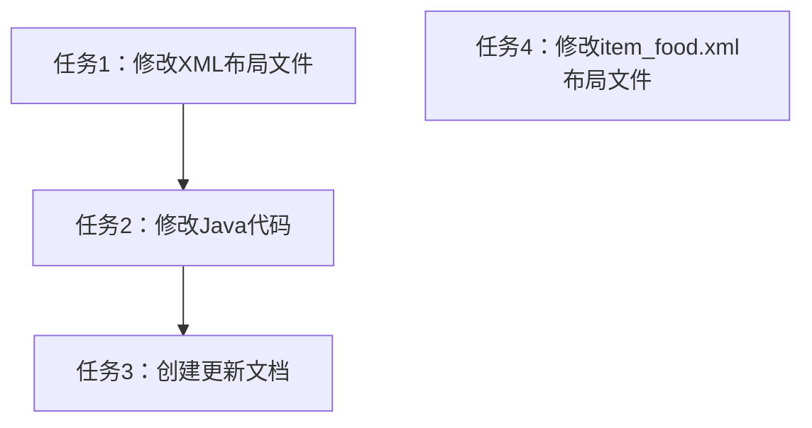

# 任务拆分文档 - UI更新

## 任务列表

### 任务4：修改item_food.xml布局文件

**输入契约**：
- 现有item_food.xml文件
- 卡片式UI设计要求

**输出契约**：
- 更新后的item_food.xml文件
- 使用CardView实现卡片式设计
- 保留原有内容结构和控件ID

**实现约束**：
- 使用androidx.cardview.widget.CardView
- 添加适当的圆角和阴影效果
- 优化内部元素对齐
- 确保布局适配各种屏幕尺寸

**依赖关系**：
- 前置任务：无
- 后置任务：无

### 任务1：修改fragment_home.xml布局文件

**输入契约**：
- 现有fragment_home.xml文件
- UI设计要求：日期小卡片设计、环形进度条

**输出契约**：
- 更新后的fragment_home.xml文件
- 包含日期小卡片UI
- 包含环形进度条UI
- 移除日/周/月切换按钮

**实现约束**：
- 使用CardView实现日期卡片
- 使用ProgressBar实现环形进度条
- 保持原有颜色方案
- 确保布局适配6.67英寸屏幕

**依赖关系**：
- 前置任务：无
- 后置任务：任务2

### 任务2：修改HomeFragment.java文件

**输入契约**：
- 现有HomeFragment.java文件
- 更新后的fragment_home.xml文件

**输出契约**：
- 更新后的HomeFragment.java文件
- 移除日/周/月切换相关代码
- 添加环形进度条更新逻辑
- 保留日期选择功能

**实现约束**：
- 移除对Constants类的依赖，使用固定推荐范围值
- 实现updateCircularProgressBar方法
- 确保进度条值在0-100之间

**依赖关系**：
- 前置任务：任务1
- 后置任务：任务3

### 任务3：创建和更新项目文档

**输入契约**：
- 已完成的代码修改
- 项目文档模板

**输出契约**：
- 说明文档.md
- ALIGNMENT_ui_update.md
- CONSENSUS_ui_update.md
- DESIGN_ui_update.md
- TASK_ui_update.md
- ACCEPTANCE_ui_update.md

**实现约束**：
- 文档内容完整准确
- 包含项目规划、实施方案、进度记录
- 符合6A工作流要求

**依赖关系**：
- 前置任务：任务1、任务2
- 后置任务：无

## 任务依赖图

## 验收标准

### 任务4验收标准
- 布局文件编译无错误
- 食物列表项显示为卡片样式，有圆角和阴影
- 内部元素对齐合理，布局美观
- 保留原有控件ID，确保与适配器兼容
- 适配不同屏幕尺寸

### 任务1验收标准
- 布局文件编译无错误
- 日期显示为小卡片样式
- 无日/周/月切换按钮
- 紫色卡片中包含环形进度条
- UI元素布局合理，无溢出

### 任务2验收标准
- Java代码编译无错误
- 移除了所有日/周/月切换相关代码
- 成功获取并显示环形进度条和进度百分比
- 点击日期卡片能弹出日期选择器
- 进度条根据卡路里完成度正确填充

### 任务3验收标准
- 所有文档创建完成
- 文档内容完整准确
- 文档格式规范统一
- 包含必要的图表和说明